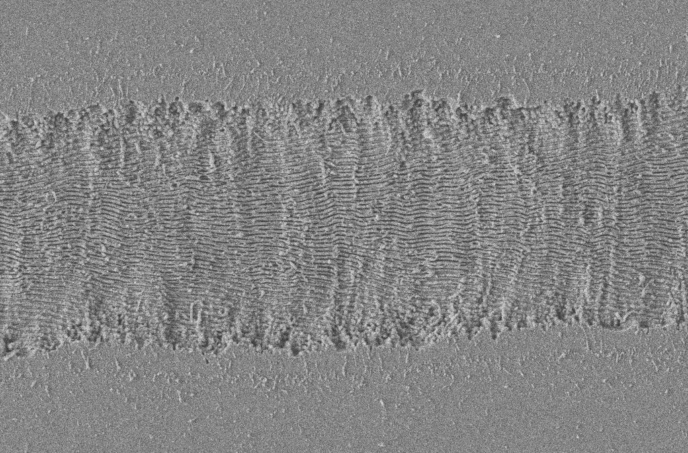
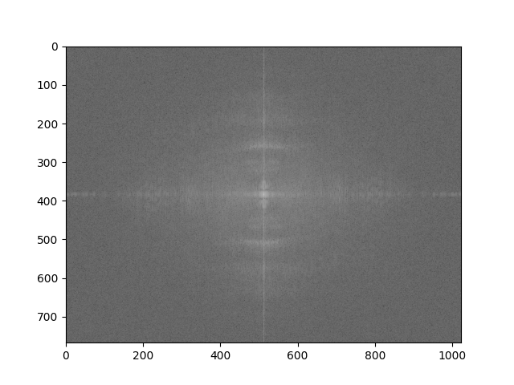
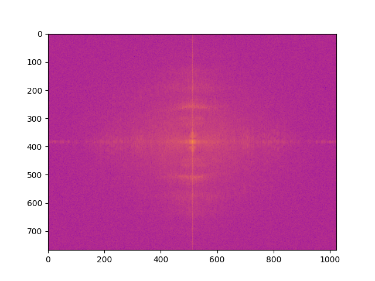
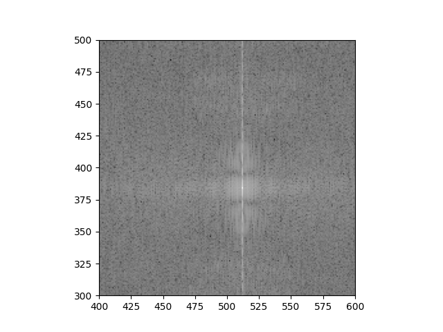
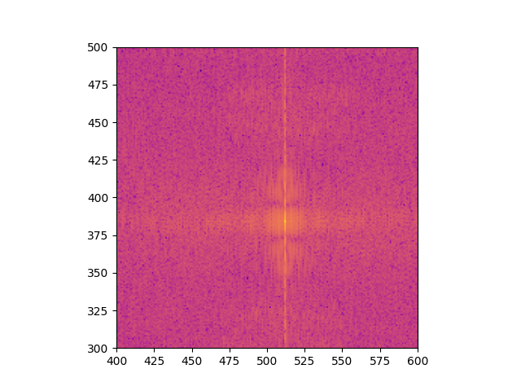

# Bulk-fast-fourier-transformer
 This python script crops all the SEM images in a folder and then apply Fourier transform into each one of them. There are 
many approches available in the market. Here, I tried to automate the process of cropping the databar of all the SEM images
in the folder and then apply fast fourier transform to each image. Both cropped and fft images are saved in the same folder with proper suffix.

# Basic usage 

- Replace the path of the folder containing images in the script with your proper path. Then run the script. (Better to run script in main folder containing your image collectiion folder)
- That's it. You are good to go.

# Moderate usage

- Set __plt.cmap__ values for different colour values.
- To adjust crop dimension change values in __imcrop__ variable.
- Adjust __plt.xlim__ and __plt.ylim__ for zoom in the given plot. (Most probably around center of the image)
- Can remove __np.log__ to see non log scale. Means more black and white and less grey shades.

## Sample output
- Input image is in *.tif* format

- Cropped image

- 2D FFT image

- Colourised

- Zoomed and coloured

Made with ❤️ by [Arun Gopinathan](https://www.arungopinathan.com/)

